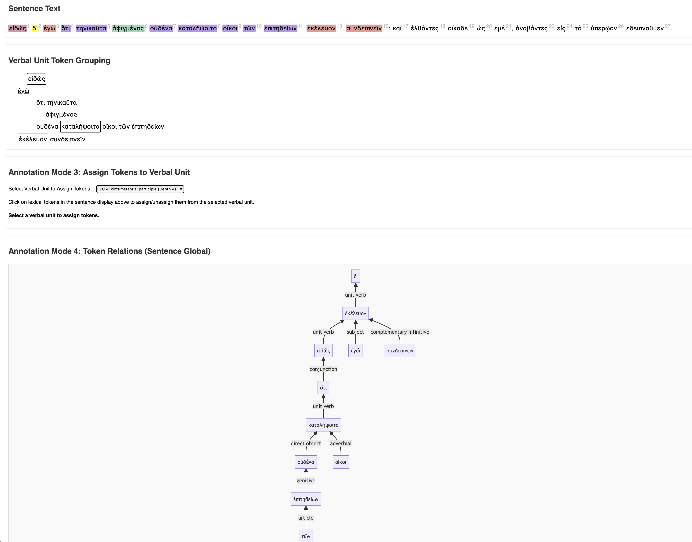

# `greeksyntaxannotator`

> *Work in progress on a vibe-coded single-page web app for annotating the syntax of ancient Greek.*

## Screen shot

## Summary

**Status**: pre-release. Basic interactive functionality is complete to tokenize a string, annotate the identified tokens, and display the analysis in various forms, including a graph diagram that can be downloaded as a PNG file.

**TBD**:

I/O functionality:

- load text from CITEable sources
- identify tokens with CTS URNs
- download analysis as a delimited-text file

UI functionality:

- delete rows from table of verbal units

**Contents**:

- `syntaxannotator.html`: current draft of web app.
- `treebankprompting.md`: text of prompts pasted into chat with Gemini 2.5 pro.
- `versions`: web pages of incremental builds

