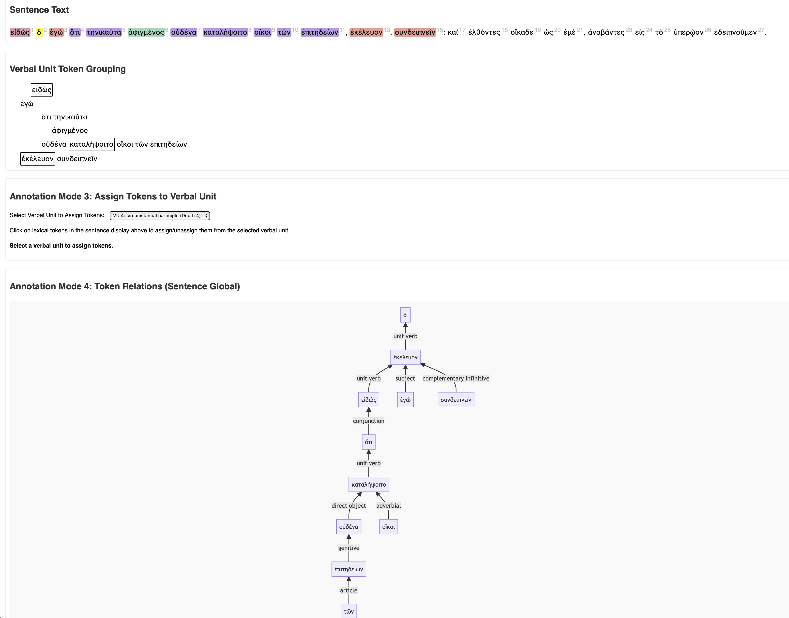

# Citable annotation of Greek syntax

> *A vibe-coded single-page web app for annotating the syntax of ancient Greek.*

`syntaxannotator.html` is an app for annotating the syntactic structure of a citable text in ancient Greek. When you load a text corpus, it is tokenized and segmented into sentences you can annotate in four steps:

1. identify connecting words (particles or conjunctions) relating this sentence to its context.
2. identify subject-verb expressions ("verbal units"), including participles and subject-verb expressions with infinitives
3. assign tokens to verbal units
4. define syntactic relations among tokens

It uses the same model of Greek syntax described in [this Julia package](https://neelsmith.github.io/GreekSyntax), and serializes annotations to the  file format documented there.

## Status

Version 2.0 is a complete rewrite. Its main features are:

- load a citable corpus from CEX source
- annotate syntax as summarized above
- save the results to a structured plain-text file

## Screen shot

## Caveats

The web app was written entirely by gemini-2.5-pro. The code passes some sanity tests, but I have not even looked at the javascript. When I encountered errors, I let gemini fix them. Use the code as you like, but be aware that I have no idea what it does or how it works.