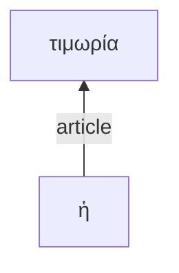

I want to write a web app as a single HTML file using HTML, Javascript and CSS. The app will allow readers to annotate tokens in a Greek text. We'll develop it gradually. First I want to build a UI for loading and organizing the data the user will annotate. Begin by letting the user enter a URL for a citable corpus of texts. Use this as the default value:
`https://raw.githubusercontent.com/neelsmith/eagl-texts/refs/heads/main/texts/lysias1.cex`


To load a citable text corpus from a URL, I want to use the `cex.js` library. Please include it like this:


```<script src="https://cdn.jsdelivr.net/gh/neelsmith/cex-lib/cex.js"></script>```

Then we'll use its `loadFromUrl` function with one parameter, the user-selected URL. This will return a `Promise<CEXParser>`. When we have a parser instance, we'll use `getDelimitedData("ctsdata")` to find citable text data (CTS data) in that source. Here's an example from the library documentation of how that could work:

```
const parser = new CEXParser();
parser.loadFromUrl(url)
    .then(p => {
        console.log('CEX data loaded from URL!');
        console.log(p.getDelimitedData("ctsdata"));
    })
    .catch(error => console.error('Failed to load from URL:', error));


```

`getDelimitedData` will return a string with each line representing a citable passage of text. Please split this into an Array of strings with one entry for each line.
With the text corpus extracted, we can structure it for analysis using the `greeklib.js` library, available here:

`https://cdn.jsdelivr.net/gh/neelsmith/greeklib@1.1.0/greeklib.js`.

We'll first tokenize the corpus, using the array of strings as the only parameter to `greeklib.tokenize`. This will return an Array of `Token` objects. Each `Token` has four properties, `sequence` (an integer), and three string values named `urn`, `text` and `type`, which we'll use later. 

We'll also get a list of sentence references for the corpus. Use the array of strings as the only parameter to `greeklib.sentences`. Create a menu of these references for the user to choose from.
When the user chooses one, find the tokens that belong to that sentence using the `greeklib.tokens` function with two parameters: the identifier the user has selected, and the  array of `Token`s. This will return the array of `Token`s belonging to that sentence (a subset of the complete array of `Token`s).

Display the sentence tokens belonging as a continuous text formatted by considering the `type` property of each token. Tokens with of type `punctuation`are always followed by a space. Tokens of type `lexical` should be followed immediately by their `sequence` property formatted as superscript in silver color. This is followed by a space unless the next token is a punctuation.  Make each lexical token clickable. 

The annotating functionality will ultimately support 4 modes of annotation. The first mode must be completed before proceding to any of the others. Offer the user a check box to mark if the sentence illustrates *asyndeton*. If the user checks yes, mode 1 is complete. Otherwise, the user should be prompted to click on one node that is the *connecting word*. This word should be highlighted in the continuous display with a yellow background.

 When the user has completed the first annotation, we'll proceed to mode 2.

In mode 2, the user will edit an intially empty table with three columns, representing *verbal units*. Column 1 should have the heading "Syntactic type"; column 2 should have the heading "Semantic type"; column 3 should be labelled "Depth". The user should be given an option to add a new row to the table.  The user should then be able to choose a value for "Syntactic  type" from a list with these values: "independent clause", "subordinate clause", "circumstantial participle", "attributive participle", "indirect statement with infinitive", "indirect statement with participle". For column "Semantic type", the user should be able to choose from a list "transitive",
"intransitive", "linking". For "Depth", the user should be able to enter an integer value. When the user has entered values for all 3 columns, the user should be able to confirm and enter the values for that row. The user should be able to delete rows from the table.


Please implement this in an HTML page.

----


Great! Once the user confirmed one row, mode 2 remains available to add new rows, but mode 3 now becomes available. The table edited in mode represents *verbal units*. In mode three, the user will assign tokens to one of the defined  verbal units. The user should be able to select from a list of the verbal units, then begin clicking on tokens in the display. This should assign the token to the selected verbal unit. Clicking should function as a toggle: if the token is already assigned to the selected verbal unit, clicking should remove it from the list. Each verbal unit should be assigned a random color with 50% 

Once the user has assigned more than one token to a verbal unit, mode 4 becomes available as well. In mode 4, the user edits a table defining relations among tokens in a verbal unit. The table should have 6 columns: labelled "Reference", "Token", "Node 1", "Node 1 relation", "Node 2" and "Node 2 relation". The table should be initialzed with one row for each lexical token in the passage, using the string value of the token as the value for the "Token" column, and the ID number as the value for the "Reference" column. These columns are not editable. The columns "Node 1" and "Node 2" are initially null, user-editable integer values. The user may enter the reference number for another token. User-entered values must refer to an integer value appearing in the table's reference column.

Above the table editor, the page should include a Mermaid visualization of a top-down directed graph. Use the 3 columns with integer values as the IDs for relations among nodes; use the "Token" column as the label for the node identified by the "Reference" column. Use "Node 1 relation" as the label for edge between "Reference" and "Node 1"; use "Node 2 relation" as the label for edge between "Reference" and "Node 2".  Do not include unlinked nodes in the graph. **Example***: if a table included three rows like this:


| Reference | Token | Node 1 | Node 1 relation | Node 2 | Node 2 relation |
| --- | --- | ---  | --- | --- | --- |
| 12 |  ἡ | 14 | article | || 
| 13 |  αὐτὴ |  |  | || 
| 14 | τιμωρία |  |  | || 


THe Mermaid graph would look like:





Please implement this.

---

Fantastic! The functionality is perfect! Let's make 1 tweak. In mode 4, let's include all assigned tokens in the list, from all verbal units, and include any token identified as the connecting token (in mode 1).

---

Perfect except for one detail. The display of sentence tokens is only highlighting the current verbal unit: it should maintain highlighting on all of them, and on the connecting word if any. Could you fix this?

---

Excellent: highlighting is persisting on tokens assigned to verbal units! We're still missing highlighting on a connecting word if one has been assigned. Could you fix that?

---

Still no yellow highlighting appearing on the identified connecting word. Please review and fix.

---

Great! Now a new tweak. In editing the table of token relations, let's allow the user to choose from a popup list of values for each of the two relation columns "Node 1 Relation" and "Node 2 Relation".  The values for the relations should be the following:

```
conjunction
subordinate conjunction
relative pronoun
unit verb
predicate
subject
direct object
object of preposition
direct address
complementary infinitive
supplementary participle
modal particle
adverbial
attributive
article
pronoun
dative
genitive
```

Could you add this?

--

Lovely! One further tweak. If the sentence illustrates *asyndeton* (no connecting word), could you add to the table of token relations in Mode 4 a row to represent that? It should have reference number `0`, and token value `asyndeton`.

---
This works well. A minor fix: could you ensure that in highlighting what verbal unit a token is assigned to, each verbal unit is represented by a different randomly chosen color?