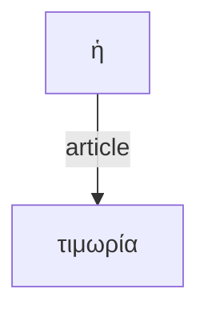

I want to write a web app as a single HTML file using HTML, Javascript and CSS. The app will allow readers to annotate tokens in a Greek text. We'll develop it gradually. First I want to build a UI for loading and organizing the data the user will annotate. Begin by letting the user enter a URL for a citable corpus of texts. Use this as the default value:
`https://raw.githubusercontent.com/neelsmith/eagl-texts/refs/heads/main/texts/herodotus.cex`

To load a citable text corpus from a URL, I want to use the `cex.js` library. Please include it like this:

```<script src="https://cdn.jsdelivr.net/gh/neelsmith/cex-lib/cex.js"></script>```

Then we'll use its `loadFromUrl` function with one parameter, the user-selected URL. This will return a `Promise<CEXParser>`. When we have a parser instance, we'll use `getDelimitedData("ctsdata")` to find citable text data (CTS data) in that source. Here's an example from the library documentation of how that could work:

```
const parser = new CEXParser();
parser.loadFromUrl(url)
    .then(p => {
        console.log('CEX data loaded from URL!');
        console.log(p.getDelimitedData("ctsdata"));
    })
    .catch(error => console.error('Failed to load from URL:', error));


```

`getDelimitedData` will return a string with each line representing a citable passage of text. Please split this into an Array of strings with one entry for each line.
With the text corpus extracted, we can structure it for analysis using the `greeklib.js` library, available here:

`https://cdn.jsdelivr.net/gh/neelsmith/greeklib@1.1.0/greeklib.js`.

We'll first tokenize the corpus, using the array of strings as the only parameter to `greeklib.tokenize`. This will return an Array of `Token` objects. Each `Token` has four properties, `sequence` (an integer), and three string values named `urn`, `text` and `type`, which we'll use later. 

We'll also get a list of sentence references for the corpus. Use the array of strings as the only parameter to `greeklib.sentences`. Create a menu of these references for the user to choose from.
When the user chooses one, find the tokens that belong to that sentence using the `greeklib.tokens` function with two parameters: the identifier the user has selected, and the  array of `Token`s. This will return the array of `Token`s belonging to that sentence (a subset of the complete array of `Token`s).

Display the sentence tokens belonging to the chosen sentence as a continuous text formatted by considering the `type` property of each token. Tokens of type `punctuation`are always followed by a space. Tokens of type `lexical` should be followed immediately by their `sequence` property formatted as superscript in silver color. This is followed by a space unless the next token is a punctuation.  Make each lexical token clickable. 

The annotating functionality will ultimately support 4 modes of annotation. The first mode must be completed before proceding to any of the others. Offer the user a check box to mark if the sentence illustrates *asyndeton*. If the user checks yes, mode 1 is complete. Otherwise, the user should be prompted to click on one lexical token that is the *connecting word*. This word should be highlighted in the continuous display with a yellow background.

When the user has completed the first annotation, we'll proceed to mode 2.

In mode 2, the user will edit an intially empty table with three columns, representing *verbal units*. Column 1 should have the heading "Syntactic type"; column 2 should have the heading "Semantic type"; column 3 should be labelled "Depth". The user should be given an option to add a new row to the table.  The user should then be able to choose a value for "Syntactic  type" from a list with these values: "independent clause", "subordinate clause", "circumstantial participle", "attributive participle", "indirect statement with infinitive", "indirect statement with participle". For the column "Semantic type", the user should be able to choose from a list "transitive", "intransitive", "linking". For "Depth", the user should be able to enter an integer value. When the user has entered values for all 3 columns, the user should be able to confirm the values for that row and add the row to the table. The user should be able to delete rows from the table. For each verbal unit, choose a pastel color that is easily distinguished from all other selected colors.

Once the user confirmed one row in the verbal units table, mode 2 remains available to add new rows, but mode 3 now becomes available. The table edited in mode 2 represents *verbal units*. In mode 3, the user will assign tokens to one of the defined  verbal units. The user should be able to select from a menu of the verbal units immediately below the display of sentence tokens, then begin clicking on tokens in the display. This should assign the token to the selected verbal unit. Clicking should function as a toggle: if the token is already assigned to the selected verbal unit, clicking should remove it from the list. When a token is assigned to a verbal unit, it should be highlighted using the previously chosen color for that verbal unit.

Once the user has assigned more than one token to a verbal unit, mode 4 becomes available as well. In mode 4, the user edits a table defining relations among tokens in the sentence. The table should have 6 columns: labelled "Reference", "Token", "Node 1", "Node 1 relation", "Node 2" and "Node 2 relation". The table should be initialzed with one row for each lexical token in the passage, using the string value of the token as the value for the "Token" column, and the ID number as the value for the "Reference" column. These columns are not editable. The columns "Node 1" and "Node 2" are initially null, user-editable integer values. The user may enter the reference number for another token. User-entered values must refer to an integer value appearing in the table's reference column.
In editing the two columns "Node 1 Relation" and "Node 2 Relation", users should be able to choose from this list of values:

```
conjunction
subordinate conjunction
relative pronoun
unit verb
predicate
subject
direct object
agent
object of preposition
direct address
complementary infinitive
supplementary participle
modal particle
adverbial
attributive
article
pronoun
dative
genitive
```


The user should be able to add a new row to this table for an *implied* token. The `Reference` value for the additional token should be a unique integer value. The `Token` column should have the value `implied`. The Do not add *implied* tokens to the display of sentence tokens.


Above the table editor, the page should include a Mermaid visualization of a  directed graph. Use the 3 columns with integer values as the IDs for relations among nodes; use the "Token" column as the label for the node identified by the "Reference" column. Use "Node 1 relation" as the label for edge between "Reference" and "Node 1"; use "Node 2 relation" as the label for edge between "Reference" and "Node 2".  Do not include unlinked nodes in the graph. The user should be able to choose between top to bottom and right to left display of the graph.
**Example***: if a table included three rows like this:

| Reference | Token | Node 1 | Node 1 relation | Node 2 | Node 2 relation |
| --- | --- | ---  | --- | --- | --- |
| 12 |  ἡ | 14 | article | || 
| 13 |  αὐτὴ |  |  | || 
| 14 | τιμωρία |  |  | || 


and the user chose top to bottom display, the Mermaid graph would look like:




The user should have an option to download the mermaid display as a PNG file.

The user should also have an to download the annotations data. We'll write data for sentences, verbal units, and tokens to a single plain-text file, with 3 blocks of delimited-text data.

The first block will begin with a labelling line `#!sentences`, followed by a pipe-delimited header line `sentence|sequence|connector`. This will be followed by one line for each annotated sentence, with three pipe-delimited columns. The first column will be the identifier for the sentence in the form used in the user menu. The second column will be the sequence number of that sentence in the menu. The third column will be an identifier for the connecting word, or empty if the sentence illustrates asyndeton. The identifier to use is the `urn` property of the `Token` object that the user chose as the connecting word.
**Example**: If the user chose a sentence identifier `urn:cts:greekLit:tlg0540.tlg001.omar_tokens:1.6.1-1.6.46a`, and it was the tenth sentence in the menu, then chose a token with text value `γὰρ` that was identified by the `urn` property `urn:cts:greekLit:tlg0540.tlg001.omar_tokens:1.6.2`, that would be represented with this line:

`urn:cts:greekLit:tlg0540.tlg001.omar_tokens:1.6.1-1.6.46a|10|urn:cts:greekLit:tlg0540.tlg001.omar_tokens:1.6.2`

The second block will begin with a labelling line `#!verbal_units`, then the pipe-delimited header line `vuid|syntactic_type|semantic_type|depth|sentence`, followed by one pipe-delimited line of data for each verbal unit. `vuid` is a unique id for this verbal unit; `syntactic_type`, `semantic_type`, and `depth` are the values of the columns "Syntactic type", "Semantic type",  and "Depth", respectively. `sentence` is the same ID value for the sentence that was used in the first block of sentences (and hence can be used by other applications to join verbal units and sentences)

The third block will begin with a labelling line  `#!tokens`, then the pipe-delimited header line `urn|reference|tokentype|text|verbalunit|node1|node1relation|node2|node2relation`.  This will be followed by one line for each record in the user-edited table for mode 4 defining relations among nodes.  If the node is an *implied* node, the `urn` value should be `implied`; otherwise, the value should be the value of the `urn` property of the `Token` object that was annotated. The value for `verbalunit` will be the verbal unit the token was assigned to. For implied tokens, the `verbalunit` column use the value for verbal unit of any node linked to it. **Example**: If a row in the table with reference ID `-1` had a token value of `implied` we would look for a related node that had `-1` for its "Node 1 Relation". If the first node we found with a "Node 1 Relation" of `-1` was assigned to the verbal unit `1749409472121`, we would also use `1749409472121` as the value for the verbal unit of the implied node.

The remaining columns will have the values of the columns "Reference", "Token", "Node 1 (ID)", "Node 1 Relation", "Node 2 (ID)", and "Node 2 Relation" from the user-edited table.

Could you please implement this?

---

Superb! Let's make a few UI tweaks, without changing any functionality.
Please move the section labelled "Mode 1: Asyndeton / Connecting Word" immediately below the menu to select a sentence and before the section labelled "Sentence Tokens". Change its label from "Mode 1: Asyndeton / Connecting Word" to "Annotation 1: Asyndeton / Connecting Word".

Change the heading "Mode 2: Define Verbal Units" to "Annotation 2: Define Verbal Units".

Change the heading "Mode 3: Assign Tokens to Verbal Units" to "Annotation 3: Assign Tokens to Verbal Units"

Move the section labelled "Mermaid Graph Visualization" to come immediately before the section "Mode 4: Define Token Relations". Change the heading "Mermaid Graph Visualization"  to "Syntax Graph Visualization". Change the heading "Mode 4: Define Token Relations" to "Annotation 4: Define Token Relations".

---

Excellent. Now I'd like to *remove* the option to download the Memaid graph. (Download of annotations should remain unchanged.) Move the section labelled
"Annotation 3: Assign Tokens to Verbal Units" immediately below the display of "Sentence Tokens" and above the section "Annotation 2: Define Verbal Units". 

---