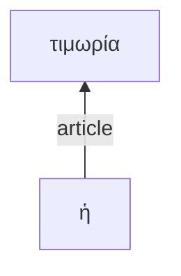

I want to write a web app as a single HTML file using HTML, Javascript and CSS. The app will allow readers to annotate tokens in a Greek text. We'll develop it gradually. First, we want a function to analyze a Greek string as a series of classified tokens. Any occurrence of the following characters is a token of class *punctuation*: `.`, `,`, `:`, `;`.  Any constinuous sequence of characters that is not a white space character and not a punctuation token constitutes a token of class *lexical*. White space characters separate tokens but do not form part of a token. **Example**: the string "ἀποδέδοται, ὥστε" consists of 3 tokens: the lexical token `ἀποδέδοται`, the punctuation token `,` and the lexical token `ὥστε`. 

To begin, let the user enter a string, then tokenize it. Assign each *lexical* token a sequential integer ID. In the preceding example, `ἀποδέδοται` would have the ID `1`, and `ὥστε` `2`; the token `,` gets no ID because it is not lexical. Display the tokens as a continuous text formatted as follows. Punctuation tokens are always followed by a space.
Lexical tokens should be followed immediately by their ID value formatted as superscript in silver color. This is followed by a space unless the next token is a punctuation.

Please implement this in an HTML file.
---

Great! Next we'll make each lexical token clickable. The annotating functionality will ultimately support 4 modes of annotation. The first mode must be completed before proceding to any of the others. Offer the user a check box to mark if the sentence illustrates *asyndeton*. If the user checks yes, mode 1 is complete. Otherwise, the user should be prompted to click on one node that is the *connecting word*. This word should be highlighted in the continuous display with a yellow background.

---

Excellent. When the user has completed the first annotation, we'll proceed to mode 2.

In mode 2, the user will edit an intially empty table with three columns, representing *verbal units*. Column 1 should have the heading "Syntactic type"; column 2 should have the heading "Semantic type"; column 3 should be labelled "Depth". The user should be given an option to add a new row to the table.  The user should then be able to choose a value for "Syntactic  type" from a list with these values: "independent clause", "subordinate clause", "circumstantial participle", "attributive participle", "indirect statement with infinitive", "indirect statement with participle". For column "Semantic type", the user should be able to choose from a list "transitive",
"intransitive", "linking". For "Depth", the user should be able to enter an integer value. When the user has entered values for all 3 columns, the user should be able to confirm and enter the values for that row.

Please implement that, using this string value as the default value for the string to analyze: "περὶ τούτου γὰρ μόνου τοῦ ἀδικήματος καὶ ἐν δημοκρατίᾳ καὶ ὀλιγαρχίᾳ ἡ αὐτὴ τιμωρία τοῖς ἀσθενεστάτοις πρὸς τοὺς τὰ μέγιστα δυναμένους ἀποδέδοται, ὥστε τὸν χείριστον τῶν αὐτῶν τυγχάνειν τῷ βελτίστῳ:"

---

Great! Once the user confirmed one row, mode 2 remains available to add new rows, but mode 3 now becomes available. The table edited in mode represents *verbal units*. In mode three, the user will assign tokens to one of the defined  verbal units. The user should be able to select from a list of the verbal units, then begin clicking on tokens in the display. This should assign the token to the selected verbal unit. Clicking should function as a toggle: if the token is already assigned to the selected verbal unit, clicking should remove it from the list. Each verbal unit should be assigned a random color with 50% 

Once the user has assigned more than one token to a verbal unit, mode 4 becomes available as well. In mode 4, the user edits a table defining relations among tokens in a verbal unit. The table should have 6 columns: labelled "Reference", "Token", "Node 1", "Node 1 relation", "Node 2" and "Node 2 relation". The table should be initialzed with one row for each lexical token in the passage, using the string value of the token as the value for the "Token" column, and the ID number as the value for the "Reference" column. These columns are not editable. The columns "Node 1" and "Node 2" are initially null, user-editable integer values. The user may enter the reference number for another token. User-entered values must refer to an integer value appearing in the table's reference column.

Above the table editor, the page should include a Mermaid visualization of a top-down directed graph. Use the 3 columns with integer values as the IDs for relations among nodes; use the "Token" column as the label for the node identified by the "Reference" column. Use "Node 1 relation" as the label for edge between "Reference" and "Node 1"; use "Node 2 relation" as the label for edge between "Reference" and "Node 2".  Do not include unlinked nodes in the graph. **Example***: if a table included three rows like this:

| Reference | Token | Node 1 | Node 1 relation | Node 2 | Node 2 relation |
| --- | --- | ---  | --- | --- | --- |
| 12 |  ἡ | 14 | article | || 
| 13 |  αὐτὴ |  |  | || 
| 14 | τιμωρία |  |  | || 

THe Mermaid graph would look like:

---

Fantastic! The functionality is perfedt! Let's make 1 tweak. In mode 4, let's include all assigned tokens in the list, from all verbal units, and include any token identified as the connecting token (in mode 1).

---

Almost. We've included the connecting token in the  global list of token relations in mode 4, but are still limiting other tokens to the verbal unit selected for mode 3. It is correct for mode 3 to respect this selection, but mode 4 should include rows for all tokens assigned to *any* verbal unit.

---

Great! Let's add a further display, positioned in between  the mode 2 annotation and mode 3 annotation. All tokens assigned to a verbal should be displayed there in the following manner: if a token belongs to the same verbal unit as the preceding token, it continues on the same line. If it belongs to a different verbal unit, it begins a new line. Line beginnings should be indented according to the depth value of the verbal unit. Level 1 verbal units should be flush left; level 2 units should be indented one level further; etc. Tokens on the same line should be separated by a single white space.

---

Excellent! One small modification: if a connector token has been identified, it should be ignored in this display. **Example**: in the string `περὶ τούτου γὰρ μόνου`, if the token `γὰρ` has been identified as the connector token, only the tokens `περὶ`,  `τούτου` and `μόνου` would be used for this display element.

---

Not quite. Consider a sequence where, of the first 3 tokens, where token 1 belongs to verbal unit 1, token 2 is the connector token, and token 3 belongs to verbal unit. We place token 1 on a line to start the display. We ignore token 2 because it's the connector token. We see that connector 3 belongs to verbal unit 1 and look at the preceding token -- but here that means we should look at token 1 since we're ignoring the connector. We see that token 1 also belongs to verbal unit 1, so we continue token 3 on the same line. The current version is starting token 3 on a new line. Could you fix this?

---

Excellent! Could we tweak the display labelled "Verbal Unit Token Flow" so that the text is a little larger, and uses a Palatino font?  Please show me the entire resulting HTML file.

---

I like that better. Let's now move the position of "Formatted Output" display so that it's in between the blocks "Annotation Mode 1: Connectivity" and "Annotation 2: Clause/Phrase Analysis (Verbal Units)"

---

Very nice. Now let's add the following highlighting to the tokens in the "Verbal Unit Token Flow" display. Highlight each token based on its verbal unit using the same colors as in the "Formatted Output" display. In addition, if a token is given a value of `verb` for "Node 1 relation" in the Mode 4 editing table, please draw a black border around the token.

---

Almost perfect! Let me clarify placing the black border around tokens. If the token has a value of `verb` for "Node 1 relation", then the token to be highlighted is the one identified by the "Reference", not the one identified by the "Node 1" column.

---

Great! Now let's add a nice tweek. Give the user the option of choosing between top down (TD) or left-to-right (LR) layout of the Mermaid flowchart, and use `flowchart TD` or `flowchart LR` accordingly.

---

Excellent! One change. Let's make the choices bottom up or left-to-right. Also: is it possible to expand the height of the display area for bottom-up mermaid charts as the graph expands? Otherwise, the graph gets hard to read when the increasingly large graph is fit into the constant height.

---

Is it possible to give the user an option to save the mermaid diagram to a PNG file?

---

I want to use the `save-svg-as-png` option. Could you use this URL for the library link: `https://cdn.jsdelivr.net/npm/save-svg-as-png@1.4.17/lib/saveSvgAsPng.min.js`

(NOT `https://cdn.jsdelivr.net/npm/save-svg-as-png@1.4.17/lib/save-svg-as-png.min.js`)

---

The save-svg-as-png library is throwing errors. Let's remove that and the download option altogether. Can you explain to me how the mermaid is rendered in the browser? Does it use an Image object?

---

OK. Here's another idea for converting svg to PNG. Load the svg element as an img element, then use a canvas element to convert the image into the desired format. So, four steps are needed:

1. Extract svg as xml data string.
2. Load the xml data string into a img element
3. Convert the img element to a dataURL using a canvas element
4. Load the converted dataURL into a new img element

could we try something like that?

---

It worked!